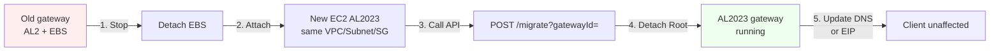

---
title: "Blog 1"
date: 2026-04-12
weight: 1
chapter: false
pre: " <b> 3.1. </b> "
---

# Automating the "blood transfusion" of AWS Storage Gateway from AL2 to AL2023 with IaC

## Context & problem

**Amazon Linux 2 (AL2)** is reaching **End-of-Support (EoS) in June 2026**. Every AWS Storage Gateway running AL2 must be moved to **Amazon Linux 2023 (AL2023)** — and AWS does not support **in-place upgrade**. With hundreds of gateways spread across multiple regions, manual migration (rebuild the gateway, re-copy data, remount clients) is virtually **impossible** at enterprise scale.

So what's the right approach?

## Solution: Terraform + Ansible


AWS proposes an **Infrastructure as Code (IaC)** pattern combining **Terraform** (provision infrastructure) and **Ansible** (configure & switch) to migrate gateways **while preserving data and configuration**:

* **No re-upload from S3** (the Cache Disk is preserved)
* **The same Gateway ID & File Share ID** are kept — clients don't need to remount
* **Downtime is only ~1-2 hours** (vs. several days when rebuilding from scratch)
* **Easy to audit & roll out** across hundreds of gateways



## 1. Terraform — provision the new infrastructure

The clever part: with only the **gateway_id** of the old gateway, Terraform automatically "asks" the Storage Gateway API for the current EC2 information.

```hcl
# main.tf - Create an AL2023 EC2 with the same network config as the old gateway
variable "gateway_id" {
  description = "ID of the old Storage Gateway to migrate"
  type        = string
}

data "aws_storagegateway_gateway" "old" {
  gateway_id = var.gateway_id
}

# Get the current EC2 info via the Storage Gateway API
locals {
  ec2_instance_id = data.aws_storagegateway_gateway.old.ec2_instance_id
}

data "aws_instance" "old_gw" {
  instance_id = local.ec2_instance_id
}

# Create a new AL2023 EC2 with the same VPC, Subnet, Security Group, KeyPair
resource "aws_instance" "gw_al2023" {
  ami                    = data.aws_ami.amazon_linux_2023.id
  instance_type          = data.aws_instance.old_gw.instance_type
  subnet_id              = data.aws_instance.old_gw.subnet_id
  vpc_security_group_ids = data.aws_instance.old_gw.vpc_security_group_ids
  key_name               = data.aws_instance.old_gw.key_name
  ebs_optimized          = data.aws_instance.old_gw.ebs_optimized
  # No EBS attached - Ansible will attach volumes from the old gateway
  user_data = <<-EOF
    #!/bin/bash
    yum update -y
    # Install the Storage Gateway AMI activation key
    EOF

  tags = {
    Name        = "sgw-al2023-${var.gateway_id}"
    Project     = "storage-gateway-migration"
    OldGateway  = var.gateway_id
  }
}

data "aws_ami" "amazon_linux_2023" {
  most_recent = true
  owners      = ["137112412989"]
  filter {
    name   = "name"
    values = ["amzn2-ami-kernel-5.10-hvm-2.0.*"]
  }
}
```

Terraform will:
1. Call `storagegateway:DescribeGateway` to get the old gateway's metadata.
2. Call `ec2:DescribeInstances` to get the EC2 instance backing the gateway.
3. Create a new AL2023 EC2 with the **exact same VPC, Subnet, Security Group, Key Pair** as the old gateway.

## 2. Ansible — the actual gateway switch

After the AL2023 EC2 is created, the Ansible playbook handles the "blood transfusion":

```yaml
# migrate-gateway.yml
- name: Migrate AWS Storage Gateway AL2 -> AL2023
  hosts: localhost
  vars:
    old_instance_id: "i-0abc123def456"      # old gateway
    new_instance_id: "i-0xyz789ghi012"      # new AL2023 gateway
    gateway_id: "sgw-AAAA123456BBBB"
    region: "ap-southeast-1"

  tasks:
    - name: Stop old gateway instance
      ec2_instance:
        instance_ids: "{{ old_instance_id }}"
        state: stopped
        region: "{{ region }}"

    - name: Get all EBS volumes attached to old instance
      ec2_vol_info:
        region: "{{ region }}"
        filters:
          attachment.instance-id: "{{ old_instance_id }}"
      register: old_volumes

    - name: Detach all volumes from old instance
      ec2_vol:
        id: "{{ item.id }}"
        instance: "{{ old_instance_id }}"
        region: "{{ region }}"
        state: absent
      loop: "{{ old_volumes.volumes }}"

    - name: Attach volumes to new AL2023 instance
      ec2_vol:
        id: "{{ item.id }}"
        instance: "{{ new_instance_id }}"
        device_name: "{{ item.attachments[0].device }}"
        region: "{{ region }}"
        delete_on_termination: false
      loop: "{{ old_volumes.volumes }}"

    - name: Migrate gateway via AWS CLI
      command: >
        aws storagegateway migrate-gateway
        --gateway-id {{ gateway_id }}
        --region {{ region }}

    - name: Detach old root volume from new instance
      ec2_vol:
        id: "{{ old_root_volume_id }}"
        instance: "{{ new_instance_id }}"
        region: "{{ region }}"
        state: absent
      when: old_root_volume_id is defined

    - name: Reboot new AL2023 instance
      ec2_instance:
        instance_ids: "{{ new_instance_id }}"
        state: restarted
        region: "{{ region }}"

    - name: Rejoin Active Directory (if applicable)
      command: >
        aws storagegateway join-domain
        --gateway-id {{ gateway_id }}
        --domain-name {{ ad_domain }}
        --user-name {{ ad_user }}
        --password '{{ ad_password }}'
        --region {{ region }}
      when: ad_enabled | default(false)
```

Key steps:

1. **Stop** the old AL2 instance.
2. **Detach all EBS** (Root Disk + Cache Disk).
3. **Attach** the volumes to the new AL2023 instance.
4. Call `aws storagegateway migrate-gateway --gateway-id <id>` so AWS knows the gateway has moved to the new host.
5. **Remove the old Root Disk** (the Cache Disk is kept — it contains the data).
6. **Reboot** the AL2023 instance.
7. (Optional) **Rejoin Active Directory** if the gateway was domain-joined.

## 3. Rerouting connections (DNS / EIP)

After the AL2023 gateway is running, you need to make sure SMB/NFS clients connect to the new instance:

**Option 1 — DNS (recommended):**

```bash
# Update a CNAME or A record
aws route53 change-resource-record-sets --hosted-zone-id Z123 \
  --change-batch '{
    "Changes": [{
      "Action": "UPSERT",
      "ResourceRecordSet": {
        "Name": "fileserver.corp.local",
        "Type": "A",
        "TTL": 60,
        "ResourceRecords": [{"Value": "10.0.5.42"}]
      }
    }]
  }'
```

**Option 2 — Elastic IP (if DNS isn't used):**

```bash
# Disassociate EIP from the old instance
aws ec2 disassociate-address --association-id eipassoc-xxx

# Associate EIP to the new AL2023 instance
aws ec2 associate-address \
  --instance-id i-0xyz789ghi012 \
  --allocation-id eipalloc-xxx
```

Both approaches let **clients avoid remounting the file share**, because the IP/DNS now points to the new gateway while the Gateway ID & File Share ID stay unchanged.

## Results

| Criterion | Old way (manual) | New way (Terraform + Ansible) |
|---|---|---|
| **Downtime** | 1-3 days (re-copy data from S3) | **~1-2 hours** |
| **Client impact** | Must remount file share | **None** (Gateway ID + EIP/DNS preserved) |
| **Cache data** | Lost, must re-hydrate from S3 | **Preserved** (EBS volumes re-attached) |
| **Rollout** | Manual per gateway | **Automated** for hundreds of gateways |
| **Audit** | Hard to track | **Every step logged in Terraform state + Ansible output** |
| **Rollback** | Must rebuild from scratch | **Easy** — just run the playbook in reverse |

## Why this pattern works

This is a **canonical** pattern when the OS doesn't support in-place upgrade:

> **Create new machine → Move EBS volumes → Update DNS/Elastic IP** instead of upgrading the old machine in place.

The pattern also applies to similar scenarios:
* RDS Aurora: engine version upgrade (create a new read replica then promote).
* Self-hosted databases on EC2: move the EBS volume to a new instance.
* EKS node groups: create a new node, taint the old one, drain & terminate.

## Lessons learned

1. **Automate from the start** — with 1 gateway manual is fine, with 100 it isn't. IaC makes rollouts safe.
2. **Test on one gateway first** — run it on a non-critical gateway, measure downtime, then roll out.
3. **Keep the Cache Disk intact** — the EBS volume holding the cache is the "soul" of the gateway; never delete it.
4. **Automate rollback** — the script must have a step: "on failure, re-attach the volumes back to the old instance".
5. **Tag everything** — every gateway must carry an `OldGateway` tag pointing to the old ID, which helps when incidents happen.

## References

* [Original AWS Blog (English)](https://aws.amazon.com/blogs/storage/scale-your-aws-storage-gateway-al2023-migration-with-infrastructure-as-code/)
* [AWS Storage Gateway — MigrateGateway API](https://docs.aws.amazon.com/storagegateway/latest/userguide/API_MigrateGateway.html)
* [Amazon Linux 2 End-of-Support](https://aws.amazon.com/amazon-linux-2/end-of-support/)
* [Terraform AWS Provider — Storage Gateway](https://registry.terraform.io/providers/hashicorp/aws/latest/docs/resources/storagegateway_gateway)
* [Ansible AWS Collection](https://docs.ansible.com/ansible/latest/collections/amazon/aws/index.html)