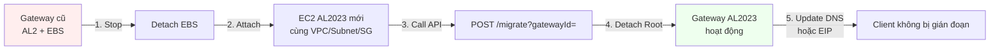

---
title: "Blog 1"
date: 2026-04-12
weight: 1
chapter: false
pre: " <b> 3.1. </b> "
---

# Tự động hóa "thay máu" AWS Storage Gateway từ AL2 sang AL2023 bằng IaC

## Bối cảnh & vấn đề

**Amazon Linux 2 (AL2)** sẽ chính thức **End-of-Support (EoS) vào tháng 6/2026**. Toàn bộ AWS Storage Gateway chạy AL2 cần được chuyển sang **Amazon Linux 2023 (AL2023)**, trong khi AWS không hỗ trợ **in-place upgrade**. Với hàng trăm gateway trải rộng nhiều Region, việc nâng cấp thủ công (tạo lại gateway, copy dữ liệu, remount client) gần như **không khả thi** ở quy mô doanh nghiệp.

Vậy đâu là cách tiếp cận đúng?

## Giải pháp: Terraform + Ansible


AWS đề xuất một pattern **Infrastructure as Code (IaC)** kết hợp **Terraform** (cấp phát hạ tầng) và **Ansible** (cấu hình & chuyển đổi) giúp di chuyển gateway **mà vẫn giữ nguyên dữ liệu và cấu hình**:

* **Không phải upload lại dữ liệu từ S3** (giữ nguyên Cache Disk)
* **Giữ nguyên Gateway ID & File Share ID** → client không cần remount
* **Downtime chỉ ~1-2 giờ** (thay vì vài ngày nếu dựng lại từ đầu)
* **Dễ audit & nhân rộng** cho hàng trăm gateway



## 1. Terraform – Cấp phát hạ tầng mới

Điểm hay của giải pháp: chỉ cần **gateway_id** của gateway cũ, Terraform sẽ tự động "hỏi" Storage Gateway API để lấy thông tin EC2 hiện tại.

```hcl
# main.tf - Tạo EC2 AL2023 với cấu hình mạng tương đương gateway cũ
variable "gateway_id" {
  description = "ID của Storage Gateway cũ cần migrate"
  type        = string
}

data "aws_storagegateway_gateway" "old" {
  gateway_id = var.gateway_id
}

# Lấy thông tin EC2 hiện tại qua Storage Gateway API
locals {
  ec2_instance_id = data.aws_storagegateway_gateway.old.ec2_instance_id
}

data "aws_instance" "old_gw" {
  instance_id = local.ec2_instance_id
}

# Tạo EC2 AL2023 mới với cùng VPC, Subnet, Security Group, KeyPair
resource "aws_instance" "gw_al2023" {
  ami                    = data.aws_ami.amazon_linux_2023.id
  instance_type          = data.aws_instance.old_gw.instance_type
  subnet_id              = data.aws_instance.old_gw.subnet_id
  vpc_security_group_ids = data.aws_instance.old_gw.vpc_security_group_ids
  key_name               = data.aws_instance.old_gw.key_name
  ebs_optimized          = data.aws_instance.old_gw.ebs_optimized
  # Không gắn EBS - Ansible sẽ attach volume từ gateway cũ
  user_data = <<-EOF
    #!/bin/bash
    yum update -y
    # Cài Storage Gateway AMI activation key
    EOF

  tags = {
    Name        = "sgw-al2023-${var.gateway_id}"
    Project     = "storage-gateway-migration"
    OldGateway  = var.gateway_id
  }
}

data "aws_ami" "amazon_linux_2023" {
  most_recent = true
  owners      = ["137112412989"]
  filter {
    name   = "name"
    values = ["amzn2-ami-kernel-5.10-hvm-2.0.*"]
  }
}
```

Terraform sẽ:
1. Gọi `storagegateway:DescribeGateway` để lấy metadata gateway cũ.
2. Gọi `ec2:DescribeInstances` để lấy thông tin EC2 instance backing gateway.
3. Tạo EC2 AL2023 mới với **đúng VPC, Subnet, Security Group, Key Pair** của gateway cũ.

## 2. Ansible – Chuyển đổi gateway

Sau khi EC2 AL2023 được tạo, Ansible playbook xử lý phần "thay máu":

```yaml
# migrate-gateway.yml
- name: Migrate AWS Storage Gateway AL2 -> AL2023
  hosts: localhost
  vars:
    old_instance_id: "i-0abc123def456"      # gateway cũ
    new_instance_id: "i-0xyz789ghi012"      # gateway AL2023
    gateway_id: "sgw-AAAA123456BBBB"
    region: "ap-southeast-1"

  tasks:
    - name: Stop old gateway instance
      ec2_instance:
        instance_ids: "{{ old_instance_id }}"
        state: stopped
        region: "{{ region }}"

    - name: Get all EBS volumes attached to old instance
      ec2_vol_info:
        region: "{{ region }}"
        filters:
          attachment.instance-id: "{{ old_instance_id }}"
      register: old_volumes

    - name: Detach all volumes from old instance
      ec2_vol:
        id: "{{ item.id }}"
        instance: "{{ old_instance_id }}"
        region: "{{ region }}"
        state: absent
      loop: "{{ old_volumes.volumes }}"

    - name: Attach volumes to new AL2023 instance
      ec2_vol:
        id: "{{ item.id }}"
        instance: "{{ new_instance_id }}"
        device_name: "{{ item.attachments[0].device }}"
        region: "{{ region }}"
        delete_on_termination: false
      loop: "{{ old_volumes.volumes }}"

    - name: Call Storage Gateway migrate API
      uri:
        url: "https://storagegateway.{{ region }}.amazonaws.com/"
        method: POST
        headers:
          X-Amz-Target: "StorageGateway_20130630.ActivateGateway"
          Content-Type: "application/x-amz-json-1.1"
        body_format: json
        body:
          gatewayId: "{{ gateway_id }}"
          # (thực tế dùng AWS SDK hoặc AWS CLI vì cần SigV4)

    - name: Migrate gateway via AWS CLI
      command: >
        aws storagegateway migrate-gateway
        --gateway-id {{ gateway_id }}
        --region {{ region }}

    - name: Detach old root volume from new instance
      ec2_vol:
        id: "{{ old_root_volume_id }}"
        instance: "{{ new_instance_id }}"
        region: "{{ region }}"
        state: absent
      when: old_root_volume_id is defined

    - name: Reboot new AL2023 instance
      ec2_instance:
        instance_ids: "{{ new_instance_id }}"
        state: restarted
        region: "{{ region }}"

    - name: Rejoin Active Directory (if applicable)
      command: >
        aws storagegateway join-domain
        --gateway-id {{ gateway_id }}
        --domain-name {{ ad_domain }}
        --user-name {{ ad_user }}
        --password '{{ ad_password }}'
        --region {{ region }}
      when: ad_enabled | default(false)
```

Các bước chính:

1. **Stop** instance AL2 cũ.
2. **Detach toàn bộ EBS** (Root Disk + Cache Disk).
3. **Attach** các volume sang instance AL2023 mới.
4. Gọi `aws storagegateway migrate-gateway --gateway-id <id>` để AWS biết gateway đã chuyển sang host mới.
5. **Gỡ Root Disk** cũ (Cache Disk vẫn giữ — chứa dữ liệu).
6. **Reboot** instance AL2023.
7. (Tuỳ chọn) **Rejoin Active Directory** nếu gateway join domain.

## 3. Chuyển hướng kết nối (DNS / EIP)

Sau khi gateway AL2023 hoạt động, cần đảm bảo client SMB/NFS kết nối tới đúng instance mới:

**Cách 1 — DNS (khuyến nghị):**

```bash
# Cập nhật bản ghi CNAME hoặc A record
aws route53 change-resource-record-sets --hosted-zone-id Z123 \
  --change-batch '{
    "Changes": [{
      "Action": "UPSERT",
      "ResourceRecordSet": {
        "Name": "fileserver.corp.local",
        "Type": "A",
        "TTL": 60,
        "ResourceRecords": [{"Value": "10.0.5.42"}]
      }
    }]
  }'
```

**Cách 2 — Elastic IP (nếu không dùng DNS):**

```bash
# Disassociate EIP từ instance cũ
aws ec2 disassociate-address --association-id eipassoc-xxx

# Associate EIP sang instance AL2023 mới
aws ec2 associate-address \
  --instance-id i-0xyz789ghi012 \
  --allocation-id eipalloc-xxx
```

Cả hai cách đều giúp **client không cần remount file share**, vì IP/DNS trỏ tới gateway mới trong khi Gateway ID & File Share ID được giữ nguyên.

## Kết quả

| Tiêu chí | Cách cũ (thủ công) | Cách mới (Terraform + Ansible) |
|---|---|---|
| **Downtime** | 1-3 ngày (copy lại dữ liệu từ S3) | **~1-2 giờ** |
| **Client impact** | Cần remount file share | **Không cần** (giữ Gateway ID + EIP/DNS) |
| **Dữ liệu Cache** | Mất, phải re-hydrate từ S3 | **Giữ nguyên** (EBS volume được attach lại) |
| **Nhân rộng** | Phải làm thủ công từng gateway | **Tự động** cho hàng trăm gateway |
| **Audit** | Khó truy vết | **Mọi bước đều log trong Terraform state + Ansible output** |
| **Rollback** | Phải dựng lại từ đầu | **Dễ dàng** — chỉ cần chạy ngược playbook |

## Tại sao pattern này hoạt động?

Đây là một pattern khá **điển hình** khi nâng cấp hệ điều hành không hỗ trợ in-place upgrade:

> **Tạo máy mới → Chuyển EBS volume → Cập nhật DNS/Elastic IP** thay vì nâng cấp trực tiếp trên máy cũ.

Pattern này cũng áp dụng được cho các trường hợp tương tự:
* RDS Aurora: nâng cấp engine version (tạo read replica mới rồi promote).
* EC2 self-hosted database: chuyển EBS volume sang instance mới.
* EKS node group: tạo node mới, taint cũ, drain & terminate.

## Bài học rút ra

1. **Tự động hoá từ đầu** — nếu bạn có 1 gateway thì làm tay được, nhưng 100 gateway thì không. IaC giúp nhân rộng an toàn.
2. **Test trên 1 gateway trước** — chạy thật trên 1 gateway ít critical, đo downtime, rồi mới rollout.
3. **Giữ Cache Disk cố định** — EBS volume chứa cache là "linh hồn" của gateway, tuyệt đối không xoá.
4. **Tự động rollback** — script phải có bước "nếu lỗi thì attach lại volume về instance cũ".
5. **Tag đầy đủ** — mỗi gateway phải có tag `OldGateway` trỏ về ID cũ, giúp tracking khi có sự cố.

## Tài liệu tham khảo

* [AWS Blog gốc (tiếng Việt)](https://aws.amazon.com/vi/blogs/storage/scale-your-aws-storage-gateway-al2023-migration-with-infrastructure-as-code/)
* [AWS Storage Gateway - Migrate Gateway API](https://docs.aws.amazon.com/storagegateway/latest/userguide/API_MigrateGateway.html)
* [Amazon Linux 2 End-of-Support](https://aws.amazon.com/amazon-linux-2/end-of-support/)
* [Terraform AWS Provider - Storage Gateway](https://registry.terraform.io/providers/hashicorp/aws/latest/docs/resources/storagegateway_gateway)
* [Ansible AWS Collection](https://docs.ansible.com/ansible/latest/collections/amazon/aws/index.html)