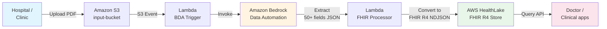

---
title: "Blog 2"
date: 2026-05-03
weight: 2
chapter: false
pre: " <b> 3.2. </b> "
---

# Automate medical record digitization with Amazon Bedrock Data Automation and AWS HealthLake

## Context — millions of paper records, countless challenges

Healthcare organizations are managing **millions of paper medical records** that are completely disconnected from modern clinical systems (EHR/EMR). Manual data entry is:

* **Costing millions of dollars** every year for data-entry staff
* **Prone to errors** because humans transcribe hard-to-read handwriting
* **Not scalable** as patient volume grows exponentially

The technical solution is to **automatically convert unstructured scanned documents into standardized, interoperable healthcare data at scale** — and AWS just released a reference architecture that does it in just a few dozen minutes of deployment.

## Solution overview

The solution uses a **serverless, event-driven architecture** to automate the entire journey from uploading a PDF file to producing queryable data.




## Core architecture components

### 1. Amazon S3 — the backbone of the pipeline

Amazon S3 acts as the **entry point** for raw PDF files and the **intermediate layer** between processing stages. S3 **event notifications** trigger the workflow automatically **without polling or scheduled jobs** — freeing the ops team from managing cron jobs.

### 2. Amazon Bedrock Data Automation (BDA) — the AI layer

This is the "heart" of the solution. BDA extracts **over 50 structured clinical data fields** from scanned PDF files, including:

* Patient demographics (name, age, gender, address)
* Diagnoses with **ICD-10 codes**
* Prescribed medications
* Vital signs (blood pressure, heart rate, temperature)
* Lab results

The service uses advanced AI capabilities and a **"medical blueprint"** to understand the document structure **without building custom ML models or providing training data**. This is critical in healthcare, where labeling training data costs hundreds of hours of specialist physicians.

### 3. AWS Lambda — the data transformation layer

Two serverless functions orchestrate the pipeline:

**BDA Trigger function** — fires when a PDF is uploaded:

```python
# lambda_bda_trigger.py
import json
import boto3
import os
from urllib.parse import unquote_plus

bedrock_data_automation = boto3.client('bedrock-data-automation')
s3 = boto3.client('s3')

def lambda_handler(event, context):
    # Read the PDF file info from the S3 event
    for record in event['Records']:
        bucket = record['s3']['bucket']['name']
        key    = unquote_plus(record['s3']['object']['key'])

        # Skip already-processed files
        if key.startswith('processed/'):
            continue

        # Invoke Bedrock Data Automation to extract clinical data
        response = bedrock_data_automation.invoke_data_automation_async(
            inputConfiguration={
                's3Uri': f's3://{bucket}/{key}'
            },
            outputConfiguration={
                's3Uri': f's3://{bucket}/bda-output/'
            },
            dataAutomationConfiguration={
                'dataAutomationArn': os.environ['BDA_MEDICAL_BLUEPRINT_ARN'],
                'stage': 'PRODUCTION'
            },
            notificationConfiguration={
                'eventBridgeConfiguration': {
                    'enabled': True
                }
            },
            dataAutomationProfileArn=os.environ['BDA_PROFILE_ARN']
        )

        print(f"Started BDA invocation {response['invocationArn']} for {key}")

    return {'statusCode': 200, 'body': 'BDA triggered'}
```

**FHIR Processor function** — reads BDA JSON output, maps data, converts to **FHIR R4 Bundle (NDJSON)** and triggers the HealthLake import:

```python
# lambda_fhir_processor.py
import json
import boto3
import os
from datetime import datetime

healthlake = boto3.client('healthlake')
s3 = boto3.client('s3')

# Mapping from BDA field -> FHIR R4 resource
ICD10_TO_FHIR = {
    "system": "http://hl7.org/fhir/sid/icd-10",
    "code":   "code",
    "display":"display"
}

def lambda_handler(event, context):
    # Get output from BDA
    bucket = event['detail']['requestParameters']['inputS3Uri'].split('/')[2]
    bda_output_prefix = 'bda-output/'

    response = s3.list_objects_v2(Bucket=bucket, Prefix=bda_output_prefix)
    for obj in response.get('Contents', []):
        key = obj['Key']
        result = s3.get_object(Bucket=bucket, Key=key)
        bda_data = json.loads(result['Body'].read())

        # Convert BDA JSON -> FHIR R4 Bundle
        fhir_bundle = convert_bda_to_fhir(bda_data)

        # Save NDJSON to S3 staging
        ndjson_key = key.replace('bda-output/', 'fhir-staging/') + '.ndjson'
        ndjson_body = '\n'.join(json.dumps(r) for r in fhir_bundle['entry'])
        s3.put_object(
            Bucket=bucket,
            Key=ndjson_key,
            Body=ndjson_body.encode('utf-8'),
            ContentType='application/fhir+ndjson'
        )

        # Fire StartFHIRImportJob into HealthLake
        datastore_id = os.environ['HEALTHLAKE_DATASTORE_ID']
        healthlake.start_fhir_import_job(
            InputDataConfig={
                'S3Uri': f's3://{bucket}/fhir-staging/'
            },
            OutputDataConfig={
                'S3Uri': f's3://{bucket}/healthlake-output/'
            },
            DataAccessRoleArn=os.environ['HEALTHLAKE_ROLE_ARN'],
            DatastoreId=datastore_id
        )

    return {'statusCode': 200}

def convert_bda_to_fhir(bda_data):
    """Convert Bedrock Data Automation output -> FHIR R4 Bundle."""
    patient = bda_data.get('patient', {})

    entries = []

    # 1. Patient resource
    entries.append({
        "resource": {
            "resourceType": "Patient",
            "id": patient.get('id', 'unknown'),
            "name": [{
                "use": "official",
                "family": patient.get('last_name', ''),
                "given": [patient.get('first_name', '')]
            }],
            "gender": patient.get('gender', 'unknown').lower(),
            "birthDate": patient.get('dob')
        }
    })

    # 2. Condition resources (ICD-10 diagnoses)
    for dx in bda_data.get('diagnoses', []):
        entries.append({
            "resource": {
                "resourceType": "Condition",
                "code": {
                    "coding": [{
                        "system": ICD10_TO_FHIR['system'],
                        "code":   dx.get('icd10_code'),
                        "display":dx.get('description')
                    }]
                },
                "subject": {"reference": f"Patient/{patient.get('id', 'unknown')}"}
            }
        })

    # 3. MedicationRequest resources
    for med in bda_data.get('medications', []):
        entries.append({
            "resource": {
                "resourceType": "MedicationRequest",
                "medicationCodeableConcept": {
                    "coding": [{
                        "system": "http://www.nlm.nih.gov/research/umls/rxnorm",
                        "code":   med.get('rxnorm_code'),
                        "display":med.get('name')
                    }]
                },
                "subject": {"reference": f"Patient/{patient.get('id', 'unknown')}"}
            }
        })

    return {"resourceType": "Bundle", "type": "transaction", "entry": entries}
```

### 4. AWS HealthLake — the FHIR-compliant data store

This is a **FHIR R4-compliant, HIPAA-eligible** data store. The system:

* **Ingests NDJSON** from Lambda
* **Validates each resource** against the FHIR R4 specification
* **Indexes** for fast querying
* **Exposes data via standardized API endpoints**

```bash
# Query patient by name through the FHIR API
curl -X GET \
  "https://healthlake.us-east-1.amazonaws.com/datastore/<DATASTORE_ID>/r4/Patient?name=John" \
  -H "Authorization: AWS4-HMAC-SHA256 ..."
```

## Infrastructure & security

The entire infrastructure is **automatically deployed as code via AWS CloudFormation** in about **15-20 minutes**:

* Services communicate through **IAM roles with least-privilege permissions**
* Data in HealthLake is **encrypted at rest** with **customer-managed KMS keys**
* The network is fully contained in a private VPC, no public endpoints

```yaml
# CloudFormation snippet - HealthLake DataStore with KMS
HealthLakeDataStore:
  Type: AWS::HealthLake::FHIRDatastore
  Properties:
    DatastoreTypeVersion: R4
    DatastoreName: !Sub "${AWS::StackName}-datastore"
    KmsEncryptionConfig:
      CmkType: CUSTOMER_MANAGED_KMS_KEY
      KmsKeyId: !GetAtt HealthLakeKMSKey.Arn
    PreloadDataConfig:
      PreloadDataType: SYNTHETIC
    IdentityProviderConfiguration:
      AuthorizationStrategy: SMART_ON_FHIR
    Tags:
      - Key: Project
        Value: medical-record-digitization
```

## ⚠️ Important security note

This reference solution is designed **for synthetic data only**. The system is **not production-ready for real Protected Health Information (PHI)** without additional HIPAA controls, for example:

* **BAA (Business Associate Agreement)** with AWS
* **Audit logging** with CloudTrail + CloudWatch
* **VPC private endpoint** for HealthLake
* **Fine-grained access control** with Cognito or IAM Identity Center
* **De-identification** of data before sending to BDA

## Results & benefits

By combining **Amazon Bedrock Data Automation** with **AWS HealthLake**, healthcare organizations can:

1. **Convert paper records into FHIR R4 data** without writing parser code for every form template.
2. **Query data instantly** through standardized APIs once it sits in AWS HealthLake.
3. **Close information gaps** during patient care — physicians can see a 10-year visit history in seconds.
4. **Integrate with EHR systems** (Epic, Cerner, Meditech…) through the FHIR API standard.
5. **Power clinical research** with standardized, easily cohortable data.

| Criterion | Old way (manual entry) | New way (BDA + HealthLake) |
|---|---|---|
| **Time to process 1000 records** | ~2-3 weeks (3 staff) | **~30 minutes** (automated) |
| **Cost** | ~$5-10/record (staff) | **<$0.50/record** (BDA + storage) |
| **Error rate** | 5-15% (handwriting, fatigue) | **<1%** (FHIR auto-validation) |
| **Queryability** | None (PDF scan) | **FHIR R4 standard API** |
| **EHR integration** | Hard (manual mapping) | **Easy** (FHIR standard) |
| **Infrastructure deploy** | — | **15-20 minutes** (CloudFormation) |

## Lessons learned

1. **Bedrock Data Automation removes the "labeling hell"** in healthcare — no need for physicians to label thousands of documents to train a model.
2. **FHIR is the future standard of digital health** — investing in FHIR R4 from day one makes EHR integration much easier later.
3. **Serverless + event-driven** is the ideal pattern for healthcare data pipelines: no server management, auto-scaling, pay only when there's a new record.
4. **NEVER** put real PHI into a system that lacks a BAA + full HIPAA controls. Start with synthetic data.
5. **Security must be "security by design"** — least-privilege IAM, customer-managed KMS keys, VPC private endpoints from the start, not bolted on later.

## References

* [AWS Architecture Blog - Automate medical record digitization with Amazon Bedrock Data Automation and AWS HealthLake](https://aws.amazon.com/blogs/architecture/automate-medical-record-digitization-with-amazon-bedrock-data-automation-and-aws-healthlake/)
* [Amazon Bedrock Data Automation documentation](https://docs.aws.amazon.com/bedrock/latest/userguide/data-automation.html)
* [AWS HealthLake documentation](https://docs.aws.amazon.com/healthlake/latest/devguide/what-is.html)
* [HL7 FHIR R4 Specification](https://www.hl7.org/fhir/R4/)
* [HIPAA Compliance on AWS](https://aws.amazon.com/compliance/hipaa-eligible-services-reference/)
* [Sample CloudFormation template](https://github.com/aws-solutions/automate-medical-record-digitization)