---
title: "Blog 2"
date: 2026-05-03
weight: 2
chapter: false
pre: " <b> 3.2. </b> "
---

# Tự động hóa số hóa bệnh án bằng Amazon Bedrock Data Automation và AWS HealthLake

## Bối cảnh — Hàng triệu hồ sơ giấy, vô số thách thức

Các cơ sở y tế hiện đang phải quản lý **hàng triệu hồ sơ bệnh án giấy** hoàn toàn tách biệt với các hệ thống lâm sàng hiện đại (EHR/EMR). Việc nhập liệu thủ công không chỉ:

* **Tốn kém hàng triệu đô la** mỗi năm cho nhân sự nhập liệu
* **Dễ gây sai sót** do con người nhập từ chữ viết tay khó đọc
* **Không thể mở rộng quy mô** khi số lượng bệnh nhân tăng theo cấp số nhân

Giải pháp cho thách thức kỹ thuật này là **tự động chuyển đổi các tài liệu quét (scanned documents) không có cấu trúc thành dữ liệu y tế chuẩn hóa có khả năng tương tác ở quy mô lớn** — và AWS vừa ra mắt một kiến trúc mẫu làm điều đó chỉ trong vài chục phút triển khai.

## Tổng quan giải pháp

Giải pháp sử dụng một **kiến trúc phi máy chủ (serverless)**, **hướng sự kiện (event-driven)** để tự động hóa toàn bộ hành trình từ việc tải lên tệp PDF cho đến khi tạo ra dữ liệu có thể truy vấn được.

```mermaid
flowchart LR
  A[Bệnh viện /<br>Phòng khám] -->|Upload PDF| B[Amazon S3<br>input-bucket]
  B -->|S3 Event| C[Lambda<br>BDA Trigger]
  C -->|Invoke| D[Amazon Bedrock<br>Data Automation]
  D -->|Trích xuất<br>50+ trường JSON| E[Lambda<br>FHIR Processor]
  E -->|Convert sang<br>FHIR R4 NDJSON| F[AWS HealthLake<br>FHIR R4 Store]
  F -->|Query API| G[Bác sĩ /<br>Ứng dụng lâm sàng]

  style A fill:#e1f5ff
  style D fill:#fff4e1
  style F fill:#e8f5e9
  style G fill:#fce4ec
```




## Các thành phần cốt lõi của kiến trúc

### 1. Amazon S3 — Trục xương sống của pipeline

Amazon S3 đóng vai trò là **điểm đầu vào** cho các tệp PDF thô và **lớp trung chuyển** giữa các giai đoạn xử lý. Các **thông báo sự kiện (event notifications)** của S3 giúp kích hoạt quy trình một cách tự động mà **không cần đến cơ chế thăm dò (polling) hay các tác vụ được lên lịch (scheduled jobs)** — giải phóng team vận hành khỏi việc quản lý cron job.

### 2. Amazon Bedrock Data Automation (BDA) — Lớp trí tuệ nhân tạo

Đây là "trái tim" của giải pháp. BDA trích xuất **hơn 50 trường dữ liệu lâm sàng có cấu trúc** từ các tệp PDF được quét, bao gồm:

* Thông tin nhân khẩu học của bệnh nhân (họ tên, tuổi, giới tính, địa chỉ)
* Chẩn đoán với mã **ICD-10**
* Thuốc được kê đơn
* Dấu hiệu sinh tồn (huyết áp, nhịp tim, nhiệt độ)
* Kết quả xét nghiệm

Dịch vụ này sử dụng khả năng AI tiên tiến và một **"medical blueprint" (lược đồ y tế)** để hiểu cấu trúc tài liệu **mà không cần phải xây dựng các mô hình học máy (ML) tùy chỉnh** hay cung cấp dữ liệu huấn luyện. Điều này cực kỳ quan trọng vì trong y tế, việc gán nhãn dữ liệu huấn luyện tốn hàng trăm giờ bác sĩ chuyên khoa.

### 3. AWS Lambda — Lớp chuyển đổi dữ liệu

Hai hàm serverless đảm nhiệm việc điều phối pipeline:

**Hàm BDA Trigger** — kích hoạt khi có tệp PDF tải lên:

```python
# lambda_bda_trigger.py
import json
import boto3
import os
from urllib.parse import unquote_plus

bedrock_data_automation = boto3.client('bedrock-data-automation')
s3 = boto3.client('s3')

def lambda_handler(event, context):
    # Lấy thông tin file PDF từ S3 event
    for record in event['Records']:
        bucket = record['s3']['bucket']['name']
        key    = unquote_plus(record['s3']['object']['key'])

        # Bỏ qua file đã xử lý
        if key.startswith('processed/'):
            continue

        # Gọi Bedrock Data Automation để trích xuất dữ liệu lâm sàng
        response = bedrock_data_automation.invoke_data_automation_async(
            inputConfiguration={
                's3Uri': f's3://{bucket}/{key}'
            },
            outputConfiguration={
                's3Uri': f's3://{bucket}/bda-output/'
            },
            dataAutomationConfiguration={
                'dataAutomationArn': os.environ['BDA_MEDICAL_BLUEPRINT_ARN'],
                'stage': 'PRODUCTION'
            },
            notificationConfiguration={
                'eventBridgeConfiguration': {
                    'enabled': True
                }
            },
            dataAutomationProfileArn=os.environ['BDA_PROFILE_ARN']
        )

        print(f"Started BDA invocation {response['invocationArn']} for {key}")

    return {'statusCode': 200, 'body': 'BDA triggered'}
```

**Hàm FHIR Processor** — đọc đầu ra JSON của BDA, ánh xạ dữ liệu, chuyển đổi thành định dạng **FHIR R4 Bundle (NDJSON)** và kích hoạt tác vụ nhập vào HealthLake:

```python
# lambda_fhir_processor.py
import json
import boto3
import os
from datetime import datetime

healthlake = boto3.client('healthlake')
s3 = boto3.client('s3')

# Mapping từ field BDA -> FHIR R4 resource
ICD10_TO_FHIR = {
    "system": "http://hl7.org/fhir/sid/icd-10",
    "code":   "code",
    "display":"display"
}

def lambda_handler(event, context):
    # Lấy output từ BDA
    bucket = event['detail']['requestParameters']['inputS3Uri'].split('/')[2]
    bda_output_prefix = 'bda-output/'

    response = s3.list_objects_v2(Bucket=bucket, Prefix=bda_output_prefix)
    for obj in response.get('Contents', []):
        key = obj['Key']
        result = s3.get_object(Bucket=bucket, Key=key)
        bda_data = json.loads(result['Body'].read())

        # Convert BDA JSON -> FHIR R4 Bundle
        fhir_bundle = convert_bda_to_fhir(bda_data)

        # Lưu NDJSON vào S3 staging
        ndjson_key = key.replace('bda-output/', 'fhir-staging/') + '.ndjson'
        ndjson_body = '\n'.join(json.dumps(r) for r in fhir_bundle['entry'])
        s3.put_object(
            Bucket=bucket,
            Key=ndjson_key,
            Body=ndjson_body.encode('utf-8'),
            ContentType='application/fhir+ndjson'
        )

        # Bắn job StartFHIRImportJob vào HealthLake
        datastore_id = os.environ['HEALTHLAKE_DATASTORE_ID']
        healthlake.start_fhir_import_job(
            InputDataConfig={
                'S3Uri': f's3://{bucket}/fhir-staging/'
            },
            OutputDataConfig={
                'S3Uri': f's3://{bucket}/healthlake-output/'
            },
            DataAccessRoleArn=os.environ['HEALTHLAKE_ROLE_ARN'],
            DatastoreId=datastore_id
        )

    return {'statusCode': 200}

def convert_bda_to_fhir(bda_data):
    """Convert Bedrock Data Automation output -> FHIR R4 Bundle."""
    patient = bda_data.get('patient', {})

    entries = []

    # 1. Patient resource
    entries.append({
        "resource": {
            "resourceType": "Patient",
            "id": patient.get('id', 'unknown'),
            "name": [{
                "use": "official",
                "family": patient.get('last_name', ''),
                "given": [patient.get('first_name', '')]
            }],
            "gender": patient.get('gender', 'unknown').lower(),
            "birthDate": patient.get('dob')
        }
    })

    # 2. Condition resources (chẩn đoán ICD-10)
    for dx in bda_data.get('diagnoses', []):
        entries.append({
            "resource": {
                "resourceType": "Condition",
                "code": {
                    "coding": [{
                        "system": ICD10_TO_FHIR['system'],
                        "code":   dx.get('icd10_code'),
                        "display":dx.get('description')
                    }]
                },
                "subject": {"reference": f"Patient/{patient.get('id', 'unknown')}"}
            }
        })

    # 3. MedicationRequest resources
    for med in bda_data.get('medications', []):
        entries.append({
            "resource": {
                "resourceType": "MedicationRequest",
                "medicationCodeableConcept": {
                    "coding": [{
                        "system": "http://www.nlm.nih.gov/research/umls/rxnorm",
                        "code":   med.get('rxnorm_code'),
                        "display":med.get('name')
                    }]
                },
                "subject": {"reference": f"Patient/{patient.get('id', 'unknown')}"}
            }
        })

    return {"resourceType": "Bundle", "type": "transaction", "entry": entries}
```

### 4. AWS HealthLake — Kho dữ liệu chuẩn FHIR

Đây là **kho dữ liệu tương thích với FHIR R4** và **đủ điều kiện HIPAA**. Hệ thống này:

* **Nhận dữ liệu NDJSON** từ Lambda
* **Xác thực từng tài nguyên** theo đặc tả FHIR R4
* **Lập chỉ mục** để truy vấn nhanh
* **Cung cấp dữ liệu để truy vấn** thông qua các API endpoint chuẩn hóa

```bash
# Truy vấn bệnh nhân theo tên thông qua FHIR API
curl -X GET \
  "https://healthlake.us-east-1.amazonaws.com/datastore/<DATASTORE_ID>/r4/Patient?name=John" \
  -H "Authorization: AWS4-HMAC-SHA256 ..."
```

## Cơ sở hạ tầng & Bảo mật

Toàn bộ cơ sở hạ tầng được **triển khai tự động dưới dạng mã thông qua AWS CloudFormation** chỉ trong khoảng **15-20 phút**:

* Các dịch vụ giao tiếp với nhau bằng **các IAM roles được cấp quyền hạn tối thiểu (least-privilege permissions)**
* Dữ liệu trong HealthLake được **mã hóa ở trạng thái nghỉ** bằng các khóa do khách hàng quản lý qua **AWS KMS**
* Toàn bộ network được giới hạn trong VPC private, không có endpoint public

```yaml
# CloudFormation snippet - HealthLake DataStore với KMS
HealthLakeDataStore:
  Type: AWS::HealthLake::FHIRDatastore
  Properties:
    DatastoreTypeVersion: R4
    DatastoreName: !Sub "${AWS::StackName}-datastore"
    KmsEncryptionConfig:
      CmkType: CUSTOMER_MANAGED_KMS_KEY
      KmsKeyId: !GetAtt HealthLakeKMSKey.Arn
    PreloadDataConfig:
      PreloadDataType: SYNTHETIC
    IdentityProviderConfiguration:
      AuthorizationStrategy: SMART_ON_FHIR
    Tags:
      - Key: Project
        Value: medical-record-digitization
```

## ⚠️ Lưu ý quan trọng về bảo mật

Giải pháp mẫu này được thiết kế **chỉ để sử dụng với dữ liệu tổng hợp (synthetic data)**. Hệ thống **chưa sẵn sàng để đưa vào môi trường sản xuất với Thông tin Y tế được Bảo vệ (PHI) thực tế** nếu chưa được bổ sung các biện pháp kiểm soát bảo mật HIPAA, ví dụ:

* **BAA (Business Associate Agreement)** với AWS
* **Audit logging** với CloudTrail + CloudWatch
* **VPC private endpoint** cho HealthLake
* **Fine-grained access control** với Cognito hoặc IAM Identity Center
* **De-identification** dữ liệu trước khi đưa vào BDA

## Kết quả & lợi ích

Bằng cách kết hợp **Amazon Bedrock Data Automation** và **AWS HealthLake**, các tổ chức y tế có thể:

1. **Chuyển đổi hồ sơ giấy thành dữ liệu FHIR R4** mà không cần viết mã phân tích cú pháp cho từng loại biểu mẫu.
2. **Truy vấn dữ liệu ngay lập tức** thông qua các API chuẩn hóa khi dữ liệu đã nằm trong AWS HealthLake.
3. **Lấp đầy khoảng trống thông tin** trong quá trình chăm sóc bệnh nhân — bác sĩ có thể xem lịch sử khám bệnh 10 năm trước chỉ trong vài giây.
4. **Tích hợp với hệ thống EHR** (Epic, Cerner, Meditech…) thông qua FHIR API tiêu chuẩn.
5. **Phục vụ nghiên cứu lâm sàng** với dữ liệu đã chuẩn hóa, dễ dàng truy vấn cohort bệnh nhân.

| Tiêu chí | Cách cũ (nhập liệu thủ công) | Cách mới (BDA + HealthLake) |
|---|---|---|
| **Thời gian xử lý 1000 bệnh án** | ~2-3 tuần (3 nhân viên) | **~30 phút** (tự động) |
| **Chi phí** | ~$5-10/bệnh án (nhân sự) | **<$0.50/bệnh án** (BDA + storage) |
| **Tỉ lệ lỗi** | 5-15% (chữ viết tay, mệt mỏi) | **<1%** (validation tự động qua FHIR) |
| **Khả năng truy vấn** | Không (PDF scan) | **FHIR API chuẩn R4** |
| **Tích hợp EHR** | Khó (phải mapping thủ công) | **Dễ** (chuẩn FHIR) |
| **Triển khai hạ tầng** | — | **15-20 phút** (CloudFormation) |

## Bài học rút ra

1. **Bedrock Data Automation giúp loại bỏ "labeling hell"** trong y tế — không cần bác sĩ gán nhãn hàng ngàn tài liệu để train model.
2. **FHIR là chuẩn tương lai của y tế số** — đầu tư vào FHIR R4 ngay từ đầu giúp tích hợp EHR dễ dàng hơn sau này.
3. **Serverless + event-driven** là pattern lý tưởng cho healthcare data pipeline: không quản lý server, tự co giãn theo tải, chỉ trả tiền khi có bệnh án mới.
4. **KHÔNG BAO GIỜ** đưa PHI thật vào hệ thống chưa có BAA + đầy đủ kiểm soát HIPAA. Bắt đầu với synthetic data.
5. **Bảo mật phải là "security by design"** — least-privilege IAM, KMS customer-managed keys, VPC private endpoint ngay từ đầu, không phải nghĩ đến sau.

## Tài liệu tham khảo

* [AWS Architecture Blog - Automate medical record digitization with Amazon Bedrock Data Automation and AWS HealthLake](https://aws.amazon.com/vi/blogs/architecture/automate-medical-record-digitization-with-amazon-bedrock-data-automation-and-aws-healthlake/)
* [Amazon Bedrock Data Automation documentation](https://docs.aws.amazon.com/bedrock/latest/userguide/data-automation.html)
* [AWS HealthLake documentation](https://docs.aws.amazon.com/healthlake/latest/devguide/what-is.html)
* [HL7 FHIR R4 Specification](https://www.hl7.org/fhir/R4/)
* [HIPAA Compliance on AWS](https://aws.amazon.com/compliance/hipaa-eligible-services-reference/)
* [CloudFormation template mẫu từ AWS Solutions](https://github.com/aws-solutions/automate-medical-record-digitization)