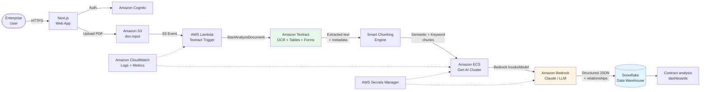

---
title: "Blog 3"
date: 2026-06-07
weight: 3
chapter: false
pre: " <b> 3.3. </b> "
---

# Lessons from the trenches: Solving automated contract intelligence with Doczy.ai™ on AWS

## Context — the pain of data trapped in contracts

Anyone running enterprise systems has lived through the pain of **critical data trapped inside unstructured documents** — contracts, legal agreements, invoices. There are three traditional ways to handle them, but each has a fatal flaw:

| Approach | Pros | Cons |
|---|---|---|
| **Manual key-in** | Simple, no tech required | Labor-intensive, error-prone, not scalable |
| **Legacy CLM (rules-based)** | Some automation | Inflexible — only configurable fields, misses complex context |
| **Traditional OCR (Textract alone)** | Extracts text from PDFs | No semantic understanding, no inter-clause relationships |

That's why **AArete** built **Doczy.ai™** — a **contract intelligence** platform on AWS that combines **Amazon Textract** (extraction) with **Amazon Bedrock** (semantic reasoning) to push accuracy from **55% (rules-based) up to 99% (AI)**.

## Architecture deep-dive from a practical perspective

AArete's stack of AWS services is pragmatic and well-engineered:




Let's walk through each layer:

### Layer 1 — UI & authentication

* **Next.js frontend** — responsive UI, server-side rendering for SEO and performance
* **Amazon Cognito** — authentication/authorization for thousands of enterprise users, with MFA and SAML federation for customer SSO

### Layer 2 — Durable storage

* **Amazon S3** — receives uploaded PDF/DOCX files, guarantees **99.999999999% (11 nines) durability** and unlimited scalability. **S3 Intelligent-Tiering** optimizes cost between hot and archival contracts.

### Layer 3 — Text & metadata extraction

* **S3 Event Notification** → triggers **AWS Lambda** (no polling needed)
* **Amazon Textract** — not only OCR but also:
  * **Forms**: detect `key-value` pairs (e.g., "Contract Value" → "1,200,000 USD")
  * **Tables**: extract pricing tables, penalty tables
  * **Queries**: natural-language Q&A like *"When does this contract expire?"*

```python
# Textract extraction flow
textract = boto3.client('textract')

response = textract.analyze_document(
    Document={'S3Object': {'Bucket': bucket, 'Name': key}},
    FeatureTypes=['FORMS', 'TABLES', 'QUERIES'],
    QueriesConfig={
        'Queries': [
            {'Text': 'What is the contract value?'},
            {'Text': 'What is the expiration date?'},
            {'Text': 'Who are the parties to this contract?'}
        ]
    }
)
```

### Layer 4 — Smart Chunking (the secret sauce)

This is **AArete's core patented algorithm**. Instead of naively chunking text into 512-token pieces (as classic RAG does — losing hierarchical context and structure), the algorithm **combines semantic search and keyword search** to:

* **Preserve the hierarchical structure** of the document (Section → Clause → Sub-clause)
* **Maintain logical relationships** between clauses (e.g., indemnity clause relates to limitation of liability)
* **Size chunks by complexity** — simple passages get bigger chunks, complex ones get smaller

```python
# Smart chunking algorithm (simplified)
import numpy as np
from sentence_transformers import SentenceTransformer

def smart_chunk(document_text, embeddings_model='amazon.titan-embed-text-v2'):
    # 1. Split document by hierarchical structure (heading, section)
    sections = split_by_hierarchy(document_text)

    chunks = []
    for section in sections:
        # 2. Compute semantic embeddings per paragraph
        embeddings = get_embeddings(section['paragraphs'])

        # 3. Semantic clustering (keep paragraphs in same topic together)
        semantic_groups = cluster_by_semantic(embeddings, threshold=0.75)

        # 4. Add keyword anchors (entity names, dates, amounts)
        for group in semantic_groups:
            chunks.append({
                'text':       group['text'],
                'section':    section['title'],
                'keywords':   extract_keywords(group['text']),
                'embedding':  group['centroid_embedding'],
                'metadata':   {
                    'page':     group['page_number'],
                    'hierarchy':section['hierarchy_path']
                }
            })

    return chunks
```

### Layer 5 — Gen AI cluster processing in parallel

* **Amazon ECS** — runs container cluster for parallel processing, auto-scaled to load
* **Amazon Bedrock** (Claude / LLM) — analyzes each chunk with custom prompt engineering
* **Dual clustering** — simultaneously analyzes **semantic** and **structural** aspects of the contract

```python
# Dual clustering: semantic + structural
def dual_cluster_analysis(chunks, contract_type):
    # Cluster by meaning: groups of clauses on the same topic
    semantic_clusters = cluster_by_meaning(
        chunks=[c['text'] for c in chunks],
        n_clusters=10
    )

    # Cluster by structure: groups of clauses with the same legal role
    structural_clusters = cluster_by_legal_role(
        chunks=[c['text'] for c in chunks],
        contract_type=contract_type  # NDA, MSA, SOW...
    )

    # Extract structured fields + relationships
    structured_output = extract_with_claude(
        chunks=chunks,
        semantic_clusters=semantic_clusters,
        structural_clusters=structural_clusters,
        blueprint=CONTRACT_BLUEPRINT[contract_type]
    )

    return structured_output
```

### Layer 6 — Data warehouse & dashboard

* **Snowflake** — stores standardized contract data (parties, dates, amounts, clauses, obligations, …)
* Analytics dashboards: contract risk, anomalous-clause ratios, ROI per vendor

### Layer 7 — Operations & security

* **Amazon CloudWatch** — real-time metrics + logs, alarms when accuracy degrades
* **AWS Secrets Manager** — API keys, Snowflake credentials, automatic rotation

## Headline numbers

Reading Doczy.ai™'s operational metrics is genuinely jaw-dropping:

| Metric | Value | Note |
|---|---|---|
| **Time in production** | 22 months | Production-grade |
| **Total documents processed** | 2.5 million contracts | ~50 million pages |
| **API calls to Bedrock** | 137 million calls | |
| **Tokens processed** | 442 billion tokens | Massive scale |
| **Manual processing reduction** | **97%** | Near full automation |
| **Customer savings** | **~$330 million USD** | |
| **Accuracy improvement** | **55% → 99%** | Rules-based vs Gen AI |

## Lessons learned

1. **Smart chunking matters more than the LLM** — don't think "dump everything into Claude" is enough. How you chunk decides 80% of output quality.
2. **Dual clustering (semantic + structural)** is the killer pattern for legal documents — semantic analysis alone misses logical relationships between clauses.
3. **Textract + Bedrock = "heavy weapon" combo** — Textract does the "reading" and "seeing" (forms, tables), Bedrock does the "understanding" and "reasoning".
4. **Serverless event-driven (S3 → Lambda → Textract) scales automatically** — from 100 contracts/day to 100,000 contracts/day without code changes.
5. **Invest in blueprint + domain knowledge** — don't try to be generic AI. Specialize in 1-2 document types before expanding.

## Conclusion

The **Doczy.ai™ on AWS** case shows that combining **Amazon Textract's** extraction power with the reasoning of **LLMs on Amazon Bedrock** is a true "heavy weapon" for enterprise document digitization. If you're struggling with:

* **E-contracts** that need automated clause extraction
* **Invoices / receipts** that need to be digitized into the ERP
* **Legal documents** that need risk analysis
* **Financial reports** that need figure aggregation

…then you should absolutely look at this technology stack!

## References

* [AWS Architecture Blog - Automating contract intelligence with Doczy.ai™ on AWS](https://aws.amazon.com/blogs/architecture/automating-contract-intelligence-with-doczy-ai-on-aws/)
* [Amazon Textract Documentation](https://docs.aws.amazon.com/textract/latest/dg/what-is.html)
* [Amazon Bedrock Documentation](https://docs.aws.amazon.com/bedrock/latest/userguide/what-is-bedrock.html)
* [Amazon Cognito Documentation](https://docs.aws.amazon.com/cognito/latest/developerguide/what-is-cognito.html)
* [Snowflake on AWS](https://aws.amazon.com/snowflake/)
* [Pattern: Serverless document processing pipeline](https://docs.aws.amazon.com/prescriptive-guidance/latest/patterns/serverless-document-pipeline.html)