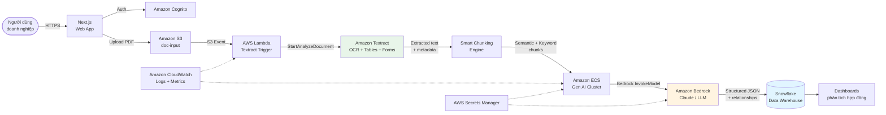

---
title: "Blog 3"
date: 2026-06-07
weight: 3
chapter: false
pre: " <b> 3.3. </b> "
---

# Kinh nghiệm thực chiến: Giải bài toán đọc hợp đồng tự động với Doczy.ai™ trên AWS

## Bối cảnh — Nỗi khổ dữ liệu bị "nhốt" trong hợp đồng

Anh em làm hệ thống enterprise chắc đều thấm nỗi khổ khi **dữ liệu quan trọng bị kẹt trong các tài liệu phi cấu trúc** như hợp đồng, thỏa thuận pháp lý hay hóa đơn. Có 3 cách "truyền thống" để xử lý, nhưng cách nào cũng có nhược điểm chí tử:

| Cách tiếp cận | Ưu điểm | Nhược điểm |
|---|---|---|
| **Làm tay (manual key-in)** | Đơn giản, không cần công nghệ | Tốn nguồn lực, dễ sai sót, không scale |
| **Hệ thống CLM cũ (rules-based)** | Có automation | Thiếu linh hoạt, chỉ cấu hình được các trường định sẵn |
| **OCR truyền thống (Textract alone)** | Trích xuất text từ PDF | Không hiểu ngữ nghĩa, không bắt được mối quan hệ giữa các điều khoản |

Chính vì vậy, công ty **AArete** đã xây dựng **Doczy.ai™** — một hệ thống **contract intelligence** chạy trên AWS, kết hợp **Amazon Textract** (trích xuất) với **Amazon Bedrock** (suy luận ngữ nghĩa) để nâng độ chính xác từ **mức 55% của hệ thống dựa trên luật (rules-based) lên tới 99% với AI**.

## "Mổ xẻ" kiến trúc dưới góc nhìn thực tế

Cách AArete lắp ghép các service AWS rất thực dụng và bài bản:




Cùng phân tích từng lớp:

### Lớp 1 — Giao diện & xác thực

* **Next.js frontend** — UI responsive, server-side rendering tốt cho SEO và performance
* **Amazon Cognito** — quản lý authentication/authorization cho hàng nghìn user doanh nghiệp, hỗ trợ MFA, SAML federation với SSO của khách hàng

### Lớp 2 — Lưu trữ bền bỉ

* **Amazon S3** — nhận file PDF/DOCX upload lên, đảm bảo **durability 99.999999999% (11 nines)** và khả năng mở rộng không giới hạn. Cấu hình **S3 Intelligent-Tiering** để tối ưu chi phí giữa các tài liệu truy cập thường xuyên vs. tài liệu lưu trữ lâu năm.

### Lớp 3 — Trích xuất văn bản & metadata

* **S3 Event Notification** → trigger **AWS Lambda** (không cần polling)
* **Amazon Textract** — không chỉ OCR mà còn:
  * **Forms**: phát hiện cặp `key-value` (ví dụ: "Giá trị hợp đồng" → "1.200.000 USD")
  * **Tables**: trích xuất bảng giá, bảng phạt
  * **Queries**: hỏi đáp tự nhiên kiểu *"Ngày hết hạn hợp đồng là khi nào?"*

```python
# Textract extraction flow
textract = boto3.client('textract')

response = textract.analyze_document(
    Document={'S3Object': {'Bucket': bucket, 'Name': key}},
    FeatureTypes=['FORMS', 'TABLES', 'QUERIES'],
    QueriesConfig={
        'Queries': [
            {'Text': 'What is the contract value?'},
            {'Text': 'What is the expiration date?'},
            {'Text': 'Who are the parties to this contract?'}
        ]
    }
)
```

### Lớp 4 — Smart Chunking (điểm "ăn tiền" nhất)

Đây chính là **bằng sáng chế (patent) cốt lõi** của AArete. Thay vì băm văn bản thành các đoạn 512-token kiểu RAG truyền thống (làm mất ngữ cảnh và cấu trúc phân cấp), thuật toán **kết hợp tìm kiếm ngữ nghĩa (semantic search) và từ khóa (keyword)** để:

* **Giữ nguyên cấu trúc phân cấp** của tài liệu (Section → Clause → Sub-clause)
* **Bảo toàn mối quan hệ logic** giữa các điều khoản (ví dụ: điều khoản bồi thường liên quan đến điều khoản giới hạn trách nhiệm)
* **Tối ưu kích thước chunk** theo độ phức tạp từng đoạn — đoạn đơn giản thì chunk to, đoạn rắc rối thì chunk nhỏ

```python
# Smart chunking algorithm (simplified)
import numpy as np
from sentence_transformers import SentenceTransformer

def smart_chunk(document_text, embeddings_model='amazon.titan-embed-text-v2'):
    # 1. Tách document theo cấu trúc phân cấp (heading, section)
    sections = split_by_hierarchy(document_text)

    chunks = []
    for section in sections:
        # 2. Tính embedding ngữ nghĩa cho mỗi paragraph
        embeddings = get_embeddings(section['paragraphs'])

        # 3. Phân cụm semantic (giữ các đoạn có cùng chủ đề)
        semantic_groups = cluster_by_semantic(embeddings, threshold=0.75)

        # 4. Giữ thêm keyword anchor (entity names, dates, amounts)
        for group in semantic_groups:
            chunks.append({
                'text':       group['text'],
                'section':    section['title'],
                'keywords':   extract_keywords(group['text']),
                'embedding':  group['centroid_embedding'],
                'metadata':   {
                    'page':     group['page_number'],
                    'hierarchy':section['hierarchy_path']
                }
            })

    return chunks
```

### Lớp 5 — Gen AI cluster xử lý song song

* **Amazon ECS** — chạy container cluster để xử lý song song, scale theo tải
* **Amazon Bedrock** (Claude / LLM) — phân tích từng chunk với prompt engineering chuyên biệt
* **Dual clustering** — phân tích đồng thời cả **ngữ nghĩa (semantic)** và **cấu trúc (structural)** của hợp đồng

```python
# Dual clustering: semantic + structural
def dual_cluster_analysis(chunks, contract_type):
    # Cluster theo ngữ nghĩa: nhóm các điều khoản nói về cùng chủ đề
    semantic_clusters = cluster_by_meaning(
        chunks=[c['text'] for c in chunks],
        n_clusters=10
    )

    # Cluster theo cấu trúc: nhóm các điều khoản có vai trò pháp lý giống nhau
    structural_clusters = cluster_by_legal_role(
        chunks=[c['text'] for c in chunks],
        contract_type=contract_type  # NDA, MSA, SOW...
    )

    # Trích xuất structured fields + relationships
    structured_output = extract_with_claude(
        chunks=chunks,
        semantic_clusters=semantic_clusters,
        structural_clusters=structural_clusters,
        blueprint=CONTRACT_BLUEPRINT[contract_type]
    )

    return structured_output
```

### Lớp 6 — Kho dữ liệu & Dashboard

* **Snowflake** — chứa dữ liệu hợp đồng đã chuẩn hóa (parties, dates, amounts, clauses, obligations…)
* Dashboard phân tích: rủi ro hợp đồng, tỉ lệ điều khoản bất thường, ROI theo nhà cung cấp

### Lớp 7 — Vận hành & Bảo mật

* **Amazon CloudWatch** — metrics + logs thời gian thực, alarm khi độ chính xác giảm
* **AWS Secrets Manager** — lưu API key, Snowflake credential, rotation tự động

## Con số thực tế đáng nể

Đọc mấy thông số vận hành của Doczy.ai™ mà thực sự choáng:

| Chỉ số | Giá trị | Ghi chú |
|---|---|---|
| **Thời gian vận hành** | 22 tháng | Production-grade |
| **Tổng tài liệu xử lý** | 2,5 triệu hợp đồng | Tương đương ~50 triệu trang |
| **API calls tới Bedrock** | 137 triệu lời gọi | |
| **Token xử lý** | 442 tỷ token | Quy mô cực lớn |
| **Giảm thời gian xử lý thủ công** | **97%** | Gần như tự động hoàn toàn |
| **Tiết kiệm cho khách hàng** | **~330 triệu USD** | |
| **Độ chính xác** | **55% → 99%** | Rules-based vs Gen AI |

## Bài học rút ra

1. **Smart chunking quan trọng hơn LLM** — đừng nghĩ cứ đổ hết văn bản vào Claude là xong. Cách chia chunk quyết định 80% chất lượng output.
2. **Dual clustering (semantic + structural)** là pattern mạnh cho tài liệu pháp lý — chỉ phân tích ngữ nghĩa thì sót mối quan hệ logic giữa các điều khoản.
3. **Textract + Bedrock = combo "vũ khí hạng nặng"** — Textract lo phần "đọc" và "nhìn" (forms, tables), Bedrock lo phần "hiểu" và "suy luận".
4. **Serverless event-driven (S3 → Lambda → Textract) giúp scale tự động** — từ 100 hợp đồng/ngày lên 100.000 hợp đồng/ngày mà không cần thay đổi code.
5. **Đầu tư vào blueprint + medical/legal domain knowledge** — đừng cố làm generic AI, hãy chuyên biệt hoá cho 1-2 loại tài liệu trước khi mở rộng.

## Kết luận

Qua case **Doczy.ai™ trên AWS**, việc kết hợp sức mạnh trích xuất của **Amazon Textract** với khả năng suy luận của **LLMs trên Amazon Bedrock** thực sự là một "vũ khí" hạng nặng cho bài toán số hóa văn bản doanh nghiệp. Anh em nào đang đau đầu với:

* **Hợp đồng điện tử** cần trích xuất điều khoản tự động
* **Hóa đơn / chứng từ** cần số hóa để đưa vào ERP
* **Tài liệu pháp lý** cần phân tích rủi ro
* **Báo cáo tài chính** cần tổng hợp số liệu

…thì chắc chắn nên tham khảo stack công nghệ này!

## Tài liệu tham khảo

* [AWS Architecture Blog - Automating contract intelligence with Doczy.ai™ on AWS](https://aws.amazon.com/vi/blogs/architecture/automating-contract-intelligence-with-doczy-ai-on-aws/)
* [Amazon Textract Documentation](https://docs.aws.amazon.com/textract/latest/dg/what-is.html)
* [Amazon Bedrock Documentation](https://docs.aws.amazon.com/bedrock/latest/userguide/what-is-bedrock.html)
* [Amazon Cognito Documentation](https://docs.aws.amazon.com/cognito/latest/developerguide/what-is-cognito.html)
* [Snowflake on AWS](https://aws.amazon.com/snowflake/)
* [Pattern: Serverless document processing pipeline](https://docs.aws.amazon.com/prescriptive-guidance/latest/patterns/serverless-document-pipeline.html)